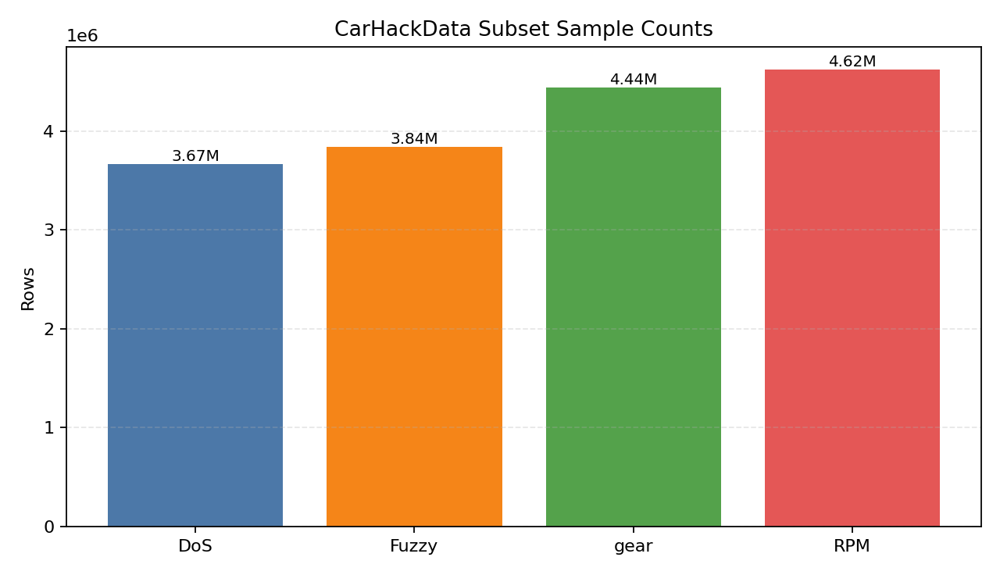
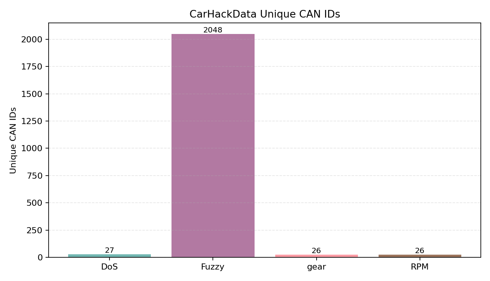
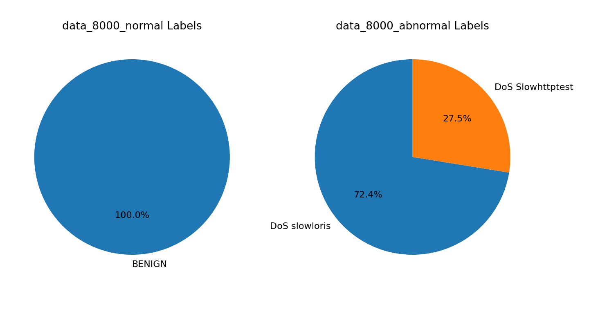
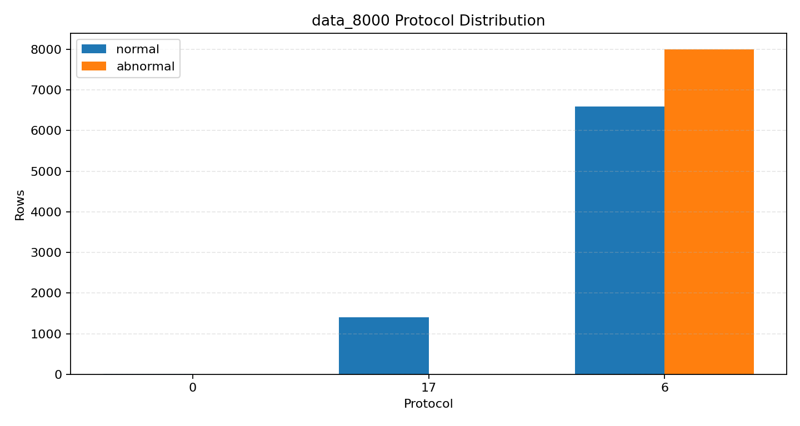

# 数据集章节（可直接用于论文）

## 1. 数据来源与组成

- **CarHackData**：包含 `DoS`、`Fuzzy`、`gear`、`RPM` 四个原始 CAN 报文序列文件。
- **流特征子集**：`data_8000_normal.csv` 与 `data_8000_abnormal.csv`，用于构建带标签的特征级分类样本。

## 2. CarHackData 统计概览

| 子集 | 样本行数 | 唯一 CAN ID 数 | 起止时间 | dt中位数(ms) | dt P95(ms) | dt最大(ms) |
|---|---:|---:|---|---:|---:|---:|
| DoS_dataset | 3,665,771 | 27 | 2016-11-04 02:39:36 ~ 2016-11-04 03:26:49 | 0.245 | 5.308 | 21.574 |
| Fuzzy_dataset | 3,838,860 | 2048 | 2016-11-04 01:55:21 ~ 2016-11-04 03:26:49 | 0.244 | 4.953 | 19.981 |
| gear_dataset | 4,443,142 | 26 | 2016-11-04 01:13:10 ~ 2016-11-04 03:26:49 | 0.243 | 2.187 | 18.235 |
| RPM_dataset | 4,621,702 | 26 | 2016-11-04 00:37:10 ~ 2016-11-04 03:26:49 | 0.243 | 1.999 | 14.136 |

### 2.1 各子集高频 CAN ID（Top10）

**DoS_dataset**

- `0000`: 587,521
- `0130`: 168,118
- `0002`: 167,556
- `0131`: 167,016
- `0140`: 167,002
- `018f`: 166,931
- `02c0`: 166,713
- `0370`: 166,681
- `0316`: 166,631
- `0153`: 166,573

**Fuzzy_dataset**

- `0316`: 182,121
- `0002`: 180,011
- `018f`: 179,802
- `02c0`: 179,637
- `043f`: 179,538
- `0350`: 178,687
- `0153`: 178,188
- `0130`: 178,149
- `0260`: 178,049
- `0370`: 177,691

**gear_dataset**

- `043f`: 804,541
- `0316`: 211,325
- `018f`: 211,237
- `0002`: 209,709
- `0260`: 209,586
- `0153`: 209,177
- `02a0`: 208,224
- `0370`: 207,859
- `02c0`: 207,695
- `0350`: 207,305

**RPM_dataset**

- `0316`: 871,231
- `018f`: 218,180
- `0002`: 216,546
- `0260`: 216,523
- `0153`: 216,260
- `02c0`: 214,882
- `02a0`: 214,876
- `0370`: 214,354
- `043f`: 214,276
- `0130`: 214,157

### 2.2 DLC 分布

- **DoS_dataset**：DLC=2: 31,188, DLC=8: 3,634,583
- **Fuzzy_dataset**：DLC=2: 34,382, DLC=5: 53,451, DLC=6: 3, DLC=8: 3,751,024
- **gear_dataset**：DLC=2: 40,165, DLC=8: 4,402,977
- **RPM_dataset**：DLC=2: 41,476, DLC=8: 4,580,226

## 3. 流特征数据（data_8000）统计

### 3.1 `data_8000_normal.csv`

- 样本总数：8,000
- 标签分布：{"BENIGN": 8000}
- 协议分布：{"6": 6589, "17": 1398, "0": 13}
- Flow Duration 统计：min=-1.000, median=401,534.500, p95=116,761,961.400, max=119,999,979.000

### 3.2 `data_8000_abnormal.csv`

- 样本总数：8,000
- 标签分布：{"DoS slowloris": 5796, "DoS Slowhttptest": 2204}
- 协议分布：{"6": 8000}
- Flow Duration 统计：min=2.000, median=63,130,391.000, p95=109,578,302.450, max=119,799,403.000

## 4. 论文可直接引用文字（数据集小节）

本文实验使用两类数据源：其一为 CarHackData 原始 CAN 报文数据，覆盖 DoS、Fuzzy、gear 与 RPM 场景；其二为流特征级数据子集 `data_8000_normal.csv` 与 `data_8000_abnormal.csv`。在 CarHackData 中，各子集均包含百万级报文行，且呈现出稳定的 CAN ID 与 DLC 结构分布；在 data_8000 子集中，正常数据与异常数据在标签、协议与流持续时间统计上存在明显差异。该双源数据配置同时支持“原始报文级时序建模”和“特征级监督分类”两类任务，能够为车载入侵检测模型提供从底层报文行为到上层流量语义的互补证据。

## 5. 图片与文字介绍（可直接用于论文）

### 图1：CarHackData子集样本量



该图展示了 CarHackData 四个子集的样本规模，均达到百万量级，说明该数据源能够支撑高覆盖度的时序学习与鲁棒性评估。

### 图2：CarHackData唯一CAN ID数量



该图体现了不同攻击子集的 ID 空间复杂度差异，其中 Fuzzy 子集的 ID 多样性明显更高，适合评估模型在高扰动注入场景下的泛化能力。

### 图3：data_8000标签分布



该图显示 normal 子集为纯 BENIGN 样本，而 abnormal 子集由 slowloris 与 Slowhttptest 构成，反映了本实验在正常/异常两端具有明确监督信号。

### 图4：data_8000协议分布对比



该图反映 normal 子集中同时包含 TCP/UDP（少量协议0），abnormal 子集以 TCP 为主，说明异常流量在协议层呈现更集中模式。

## 6. 复现实验

```bash
python paper-figures/dataset-analysis/analyze_datasets.py
```
