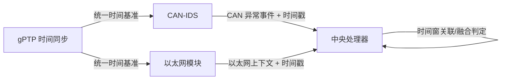

# 四个核心部件的工作流程与数据流转

本文档仅保留四个主要部件：`CAN-IDS`、`以太网模块`、`中央处理器`、`gPTP`。

## 1. 四部件关系图

## 2. 工作流程（只看主干）

1. `gPTP` 为全系统提供统一时间基准，保证 CAN 与以太网数据可在同一时间轴比较。  
2. `CAN-IDS` 在本地持续计算时钟偏移与异常特征，输出带时间戳的 CAN 异常事件。  
3. `以太网模块` 维护按时间组织的报文上下文（环形缓冲），支持快速时间窗检索。  
4. `中央处理器` 在收到 CAN 告警时，按告警时间戳从以太网模块拉取时间窗上下文。  
5. `中央处理器` 将 CAN 事件与以太网上下文进行时序对齐和融合，输出最终告警等级与类型。  

## 3. 数据流转（输入/处理/输出）

### CAN-IDS
- **输入**：CAN 报文流（ID、payload、接收时间）
- **处理**：时钟偏移估计、异常判定
- **输出**：`can_alert = {ts, can_id, score, class}`

### 以太网模块
- **输入**：以太网帧（src/dst/proto/len/ts）
- **处理**：写入环形缓冲、时间索引维护
- **输出**：`eth_context = frames[t0-Δ, t0+δ]`

### 中央处理器
- **输入**：`can_alert` + `eth_context` + 同步时间
- **处理**：跨模态时间对齐、规则融合、置信度计算
- **输出**：`final_alert = {type, confidence, evidence}`

### gPTP
- **输入**：时钟同步报文
- **处理**：主从时钟校准
- **输出**：统一高精度时间戳基准（供 CAN/以太网/中央处理器共享）

## 4. 四部件对应代码文件

- `CAN-IDS`：`REAL-IDS/cpp/src/can_ids.cpp`
- `以太网模块`：`REAL-IDS/cpp/src/eth_buffer.cpp`
- `中央处理器`：`REAL-IDS/cpp/src/central_processor.cpp`
- `gPTP` 接入与时间对齐语义：`paper-figures/system-architecture/real_ids_architecture.tex`（架构表达）

## 5. 可直接用于论文的简述

系统以 gPTP 提供统一时间基准，将 CAN-IDS 的异常事件与以太网模块的时间窗上下文在中央处理器中进行对齐和融合。该流程将“单通道异常检测”提升为“跨通道时序证据融合”，从而输出具备更高可信度与可解释性的最终告警结果。
